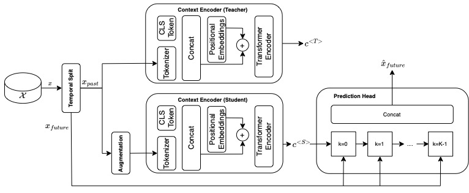

<h1>TS-MoCo: Time-Series Momentum Contrast for Self-Supervised Physiological Representation Learning</h1>

Philipp Hallgarten $^{1,2}$,
David Bethge $^{3}$,
Ozan Özdenizci $^{4,5}$,
Tobias Grosse-Puppendahl $^{1}$,
Enkelejda Kasneci $^{2}$

$^{1}$ Dr. Ing. h.c. F. Porsche AG, Germany<br/>
$^{2}$ TU Munich, Germany<br/>
$^{3}$ LMU Munich, Germany<br/>
$^{4}$ Institute of Theoretical Computer Science, TU Graz, Austria<br/>
$^{5}$ TU Graz-SAL DES Lab, Silicon Austria Labs, Graz, Austria<br/>

<p>This is the accompanying repository for the paper <a href="#"><i>TS-MoCo: Time-Series Momentum Contrast for Self-Supervised Physiological Representation Learning</i></a>, published in <i>tbd</i></p>

<div align="center">
    <a href="#">&logoColor=white&color=green"></a>
    <a href="citation">&logoColor=white&color=blue"></a>
    <!--<a href="#">&logoColor=white&color=gold"></a>-->

<br/>
<br/>
<p>Implementation based on :</p>


</div>

<h1>Abstract</h1>
<div align="center">
    
</div>

<p>
Limited availability of labeled physiological data often prohibits the use of large and powerful supervised deep learning models in the biomedical machine intelligence domain.
In this work we approach this problem and propose a novel encoding framework that relies on a self-supervised learning pipeline with momentum contrast, to learn representations from multivariate time-series of various physiological domains without the need for labels.
Our model is based on a transformer architecture that can be adapted to classification problems by adding and training a single dense layer for the outputs.
We experimentally evaluate our framework using two publicly available physiological datasets from different domains, i.e., human activity recognition from embedded inertial sensory, and emotion recognition from electroencephalography (EEG).
We show that our self-supervised learning approach can indeed learn discriminative features which can be transferred to downstream classification tasks.
Our work enables development of domain-agnostic intelligent systems that can effectively analyze multivariate time-series data from physiological domains.
</p>

<h1>Setup</h1>
We recommend to create a new environment if working with this repository. You can do so through

```
conda env create -n ENVNAME --file env.yml
```
This will also install all necessary dependencies.

<h1>Usage</h1>
To train <i>TS-MoCo</i> on a custom dataset, you will have to take the follwoing steps:
<ol>
<li>
    Add a datamodule for your dataset in the <code>datasets</code> folder (see: <a href="https://pytorch-lightning.readthedocs.io/en/stable/data/datamodule.html">lightning datamodule</a>)
</li>
<li>
    Add the datamodule with the necessary information in the <code>main.py</code> file after line 91 e.g.,

        elif args.dataset=="DatasetName":
            run_name = "task_name"
            datamodule = DataModuleName(
                args,
                batch_size,
                num_workers
        )
    
</li>
<li>
    Add a call of <code>main.py</code> to <code>run.sh</code> with all the necessary hyperparameters
</li>
<li>
    Start the training by running <code>run.sh</code>
</li>
</ol>

<h1>Citation</h1>
If you found this work useful, please cite:

```
@inproceedings{tbd,
  title     = {TS-MoCo: Time-Series Momentum Contrast for Self-Supervised Physiological Representation Learning},
  author    = {Hallgarten, Philipp and Bethge, David and Özdenizci, Ozan and Grosse-Puppendahl, Ozan and Kasneci, Enkelejda},
  booktitle = {tbd},
  pages     = {tbd},
  year      = {tbd},
}
```